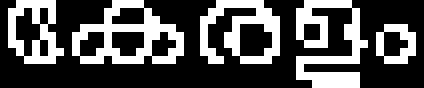
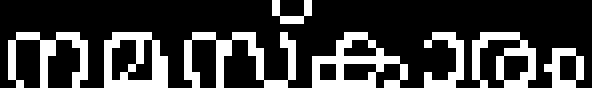
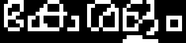
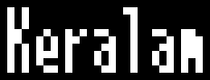
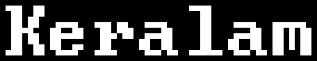
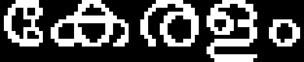
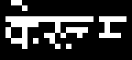

# font2badge

> [!NOTE]
> **AI-generated code.** This repository was developed with
> [Claude Code](https://claude.com/claude-code): the code and
> documentation are largely AI-generated, working under human direction
> and review.

Any font + some text → a badge-ready PNG. Shapes the text with HarfBuzz
(conjuncts, matra reordering, mark positioning — Indic scripts come out
right), rasterizes with FreeType, and writes a white-on-black strip PNG
at exactly your badge's pixel height, ready to feed to
[led-name-badge-ls32](https://github.com/fossasia/led-name-badge-ls32)
for pushing to the badge.

This is the **simple pipeline**: no font conversion, no hand-editing —
one command from TTF to badge. Its sibling
[pixelshaper](https://github.com/fraggerfox/pixelshaper) is the crafted
pipeline: it freezes the same intermediate bitmaps into an editable
pixel font you can hand-tune glyph by glyph. Start here; graduate to
pixelshaper when the thresholding artifacts start to bother you.

## Contents

- [Usage](#usage)
- [Flags](#flags)
  - [When to use `--mono`](#when-to-use---mono)
- [Examples](#examples)
  - [Malayalam, self-scaled — the default](#malayalam-self-scaled--the-default)
  - [Dotted fonts — lower the threshold](#dotted-fonts--lower-the-threshold)
  - [True pixel fonts — render on their native grid](#true-pixel-fonts--render-on-their-native-grid)
  - [A different badge height](#a-different-badge-height)
  - [Fair A/B against a pixel font](#fair-ab-against-a-pixel-font)
- [How it sizes](#how-it-sizes)

## Usage

```sh
git clone https://github.com/fraggerfox/font2badge
cd font2badge
nix develop                          # uv dev shell, venv activated
font2badge <font.ttf> "<text>" [flags]
```

The PNG lands in the current directory as `<font>-<md5:8>.png` unless
`-o` says otherwise. Push it to the badge with:

```sh
python3 lednamebadge.py -s 4 -m 4 strip.png   # mode 4 = still-centered
```

## Flags

| Flag | Default | Meaning |
|------|---------|---------|
| `-o`, `--out PATH` | `<font>-<md5:8>.png` | output PNG path |
| `-H`, `--height N` | 11 | strip height in px — set to your badge's row count (11 = FOSSASIA LS32) |
| `-t`, `--threshold F` | 0.5 | on/off cut as a fraction of peak gray; dotted fonts need ~0.25 |
| `--ppem N` | self-scale | pin the pixel size instead of scaling the ink span to the strip |
| `--mono` | off | 1-bit FreeType raster for true pixel fonts at native `--ppem`; ignores `--threshold` |
| `--dots` | off | also print the strip as ●/· rows in the terminal |

`WARNING: N ink pixels fell outside the strip` on stderr means faint
antialiased fringe (or, with `--ppem` pinned too high, real ink) was
clipped at the strip edges — a handful of pixels is normal for
self-scaled renders.

### When to use `--mono`

`--mono` replaces grayscale-then-threshold with true 1-bit rendering: a
pixel is on iff the outline covers its centre. The rule of thumb —
**self-scaling + threshold for outline fonts, `--ppem <native> --mono`
for pixel fonts**:

- **Use it when the font *is* a pixel grid, rendered on that grid.**
  k8x12, TerminalVector and pixelshaper-built fonts have outlines that
  are stacks of pixel squares; at their native ppem each square lands on
  exactly one device pixel, so 1-bit rendering reproduces the design
  bit-for-bit. That's why `--mono` almost always travels with
  `--ppem <native>`.
- **Don't use it on ordinary outline fonts.** At LED sizes their strokes
  are fractions of a pixel wide; mono makes a hard 50 %-coverage call
  with no recourse, and thin strokes vanish outright (Nupuram Dots
  disappears entirely — no single dot covers half a pixel). Grayscale +
  `-t` gives you the dial that mono denies you.
- **Don't combine it with self-scaling.** A fractional ppem puts even a
  pixel font's squares astride device pixels; mono then drops half of
  every straddling stroke — the worst of both worlds.

## Examples

All run against the fonts used in the pixelshaper examples; outputs are
verbatim. The PNGs live in [examples/](examples/) — each shown below at
8× nearest-neighbour zoom (the `@8x` copies; browsers blur-scale the
real 11 px strips). Regenerate everything with `examples/generate.sh`.

### Malayalam, self-scaled — the default

The message's own ink span is stretched to all 11 rows (ppem 16.9 for
this word), conjuncts and matras shaped by HarfBuzz:

```
$ font2badge Manjari-Regular.ttf "കേരളം" --dots
WARNING: 18 ink pixels fell outside the strip
manjari-regular-5f09f872.png (53x11, ppem 16.9)
··●●●●●·······●●●●·········●●●●●●·····●●●●●●·········
·●●·●·●······●●···●·······●●····●●···●●·····●········
·●··●·●······●····●●·····●●··●●●●●●··●●●●···●········
·●···●····●●●●●●●●●●●●···●···●···●●··●··●··●●···●●●··
·●···●●··●●··●····●●·●●··●··●●····●··●··●··●●··●··●●·
·●●·●·●··●···●····●···●··●··●●····●···●●●···●●·●···●·
··●·●·●●·●··●●●··●●··●●··●●··●···●●·········●··●··●●·
···●●●●···●●●·●●●●·●●●····●●··●●●●···●●●●●●●●···●●●··
·····································●···············
·····································●●●●●●●●········
·······································●●●●●●········
```



Any text HarfBuzz can shape works the same way:

```
$ font2badge NotoSansMalayalam-Regular.ttf "നമസ്കാരം" --dots
WARNING: 4 ink pixels fell outside the strip
notosansmalayalam-regular-de79fb4b.png (74x11, ppem 13.3)
··································●···●···································
··································●···●···································
···································●●●····································
··········································································
··●●●··●●●····●●●●●·····●●●··●●●···●·······●●●········●●●···●●●●●·········
·●···●●··●●··●●··●·●···●···●●··●···●●·····●●··●······●··●●·●●····●········
·●···●●···●··●···●·●···●···●●··●●···●·····●····●·········●·●···●●●●··●●●··
·●···●····●··●···●·●●··●···●····●···●··●●●●●●●●●●●·······●·●··●···●··●··●·
·●···●····●··●··●··●●··●···●····●···●··●··●····●··●······●·●··●···●·●●··●·
·●···●···●●··●·●···●●··●●··●····●···●··●··●···●···●··●··●●·●··●··●●··●··●·
··●··●···●···●●●●●●●●···●··●·····●●●···●●●●●●●●·●●···●●●●···●··●●●···●●●··
```



### Dotted fonts — lower the threshold

Nupuram Dots' strokes are made of dots that never reach full gray
coverage; at the default 0.5 cut they vanish. `-t 0.25` keeps them:

```
$ font2badge Nupuram-Dots.ttf "കേരളം" -t 0.25 --dots
WARNING: 3 ink pixels fell outside the strip
nupuram-dots-5f09f872.png (47x11, ppem 12.6)
··●●●●······●●●·········●●●●·····●●●·●●········
·●●··●·····●···●······●●····●···●·····●········
·●···●····●●···●······●····●●●·●······●········
·●·●●····●●●●●●●●·····●···●●·●·●●●●··●●········
·●●●···●●·●····●··●●··●··●···●·●··●·●●●···●●●●·
·●··●●·●··●····●···●··●··●···●·●···●···●··●··●·
·●···●·●··●●···●···●··●··●···●·●··●····●··●··●·
··●●●··●●●●●●●●··●●●···●●·●●●●·●●●●···●●··●●●●·
·····································●●········
································●●●●···········
·······························●●●●●●●●●·······
```



### True pixel fonts — render on their native grid

Self-scaling a pixel font resamples it off its design grid and smears
the strokes. Pin its native size and use the 1-bit rasterizer instead:

```
$ font2badge k8x12.ttf "Keralam" --ppem 12 --mono --dots
k8x12-0f8af4f6.png (29x11, ppem 12.0)
·····························
·●·●·············●●··········
·●·●··············●··········
·●·●··············●··········
·●●···●··●·●·●●···●··●●··●●··
·●●··●·●·●●····●··●····●·●●●·
·●·●·●·●·●····●●··●···●●·●●●·
·●·●·●●●·●···●·●··●··●·●·●●●·
·●·●·●···●···●·●··●··●·●·●·●·
·●·●··●●·●····●●··●···●●·●·●·
·····························
```



TerminalVector, same treatment — a 12 px terminal font whose ascent
uses 10 of the 11 rows:

```
$ font2badge TerminalVector.ttf "Keralam" --ppem 12 --mono --dots
terminalvector-keralam-native.png (57x11, ppem 12.0)
·························································
·●●●··●●··························●●●●···················
··●●··●●····························●●···················
··●●·●●·····························●●···················
··●●·●●···●●●●···●●●·●●···●●●●······●●····●●●●···●●●●●●··
··●●●●···●●··●●···●●·●●●·····●●·····●●·······●●··●●·●·●●·
··●●·●●··●●●●●●···●●●·●●··●●●●●·····●●····●●●●●··●●·●·●●·
··●●·●●··●●·······●●·····●●··●●·····●●···●●··●●··●●·●·●●·
··●●··●●·●●··●●···●●·····●●··●●·····●●···●●··●●··●●·●·●●·
·●●●··●●··●●●●···●●●●·····●●●·●●··●●●●●●··●●●·●●·●●···●●·
·························································
```



### A different badge height

The strip height follows `-H`; the same word simply self-scales bigger
(24.5 ppem on a 16-row panel):

```
$ font2badge Manjari-Regular.ttf "കേരളം" -H 16 --dots
WARNING: 18 ink pixels fell outside the strip
manjari-regular-5f09f872.png (78x16, ppem 24.5)
····●●●●●●···········●●●●●··············●●●●●●●··········●●●●●●···············
···●●●●●●●··········●●●·●●●············●●●●··●●●●······●●●●··●●●●·············
··●●··●··●●·········●●····●●··········●●·······●●●····●●·······●●·············
··●●··●··●●········●●······●●········●●····●●●●●●●····●●●●······●●············
·●●···●●●●·······●●●●●●●●●●●●●·······●····●●●··●●●●··●●●●●●·····●●············
·●●·····●······●●●●●●●●●●●●●●●●●····●●····●●·····●●··●●···●●·●●●●·····●●●●●···
·●●·····●·····●●···●·······●●··●●···●●···●●······●●··●●···●●·●●●●·····●●··●●··
·●●···●●●●···●●····●●······●●···●···●●···●●······●●···●●·●●●····●●···●●····●●·
··●●··●··●●··●●····●●······●●···●···●●···●●······●●····●●●●·····●●···●●····●●·
··●●●·●···●··●●····●●●····●●···●●····●●···●●·····●··············●●···●●····●●·
···●●●●●●●●···●●●●●●●●●··●●●··●●●·····●●··●●●··●●●·····●●●●●●●●●●·····●●·●●●··
·····●●●●●·····●●●●··●●●●●···●●●······●●···●●●●●●·····●●●●●●●●●●·······●●●●···
·····················································●●·······················
·····················································●●·······················
······················································●●●●●●●●●●●●············
·······················································●●●●●●●●●●·············
```



### Fair A/B against a pixel font

Pin the outline font to the pixel font's size so only the rendering
differs, not the scale:

```
$ font2badge Mukta-Regular.ttf "केरलम" --ppem 9 --dots
mukta-regular-b4047c14.png (24x11, ppem 9.0)
··●●····················
····●···················
························
·●●●●●●●●●●●●●●●●·●●●●●·
··●●●●●···●········●····
·●··●·····●·●●●●···●····
·●··●···●●·●··●···●●●●··
··●●●·●··●··············
····●·····●·●···········
························
························
```



## How it sizes

By default the whole string is shaped once, its ink span measured in
font units, and the ppem chosen so *this message's* ink exactly fills
the strip height (`ppem = H × upem ÷ span`). That differs from
corpus-keyed scaling (sizing for the worst-case conjunct stack), which
leaves ordinary words half-height — here every message gets the largest
size its own shapes allow.

The grayscale raster is cut to on/off at `--threshold` × peak gray.
Antialiased curves hovering near the cut flip between 1 px and 2 px
thick — that raggedness is inherent to thresholding outlines at LED
sizes, and is exactly what pixelshaper's hand-tuned pixel fonts fix.
